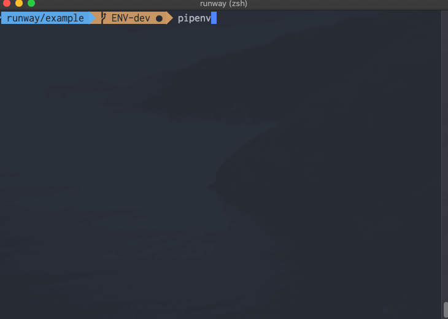

# Runway

[](https://travis-ci.org/onicagroup/runway)
[](https://pypi.org/project/runway/)
[](https://www.npmjs.com/package/@onica/runway)



Runway is the perfect companion for full stack development.
It's a lightweight integration library to ease management of multiple infrastructure deployment tools

Runway's main goal is to avoid convoluted Makefiles/CI by simplifying the deployment by integrating multiple tools into single build process with centralized environment-specific settings, e.g. dev, test, prod.


## Features

* Centralized environment-specific configuration
* Automatic environment identification from GIT branches
* Automatic linting/verification
* Support of IAM roles to assume for each deployment
* Wrangle Terraform backend/workspace configs w/per-environment tfvars

### Supported deployment tools

* AWS Cloudformation
* AWS CDK
* Terraform
* Stacker
* Serverless


## Example

A typical Runway configuration is unobtrusive, it just contains references to the paths of the inner deployments.

```yml
deployments:
  - modules:
    - path: ./resources.tf # terraform resources
    - path: ./backend.sls # serverless lambda functions
    - path: ./frontend # static web site
      class_path: runway.module.staticsite.StaticSite
    environments: # Environment settings
        dev:
            foo: dev-bar
        prod:
            foo: prod-bar
```

The example above contains enough information for Runway to deploy all resources, lambda functions and a static website backed by S3 and Cloudfront in either dev or prod environments


## Install


### cURL

Use one of the endpoints below to download a single-binary executable version of Runway based on your operating system.

| Operating System | Endpoint                             |
|------------------|--------------------------------------|
| macOS            | https://oni.ca/latest/osx/runway     |
| Ubuntu           | https://oni.ca/latest/ubnt/runway    |
| Windows          | https://oni.ca/latest/win/runway     |

```shell
$ curl -L https://oni.ca/latest/osx/runway -o runway
$ chmod +x runway
$ ./runway init
```

**Suggested use:** CloudFormation or TerraForm projects


### npm

```shell
$ npm i -D @onica/runway
$ npx runway init
```

**Suggested use:** Serverless or AWS CDK projects


### pip/pipenv

```shell
$ pip install runway
$ runway init
# OR
$ pipenv install runway
$ pipenv run runway init
```

**Suggested use:** Python projects


## How?

See the [doc site](https://docs.onica.com/projects/runway).

Complete quickstart documentation, including Docker images, CloudFormation templates, and walkthrough can be found [here](https://docs.onica.com/projects/runway/en/latest/quickstart.html)
