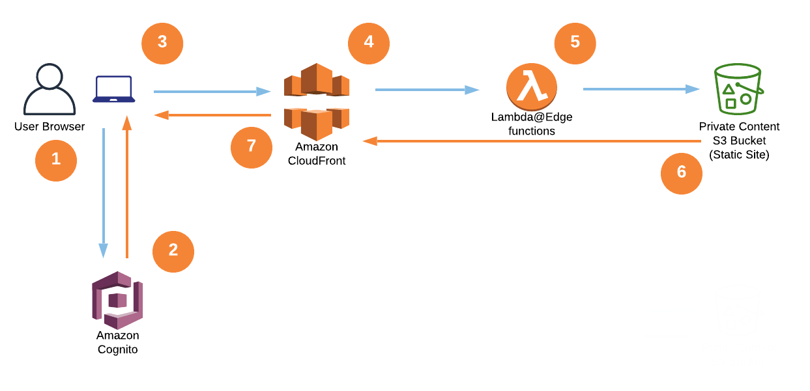

.. _mod-staticsite:

Static Site
===========

Parameters
----------

**namespace (str)**
  The unique namespace for the deployment.

  Example:

  .. code-block:: yaml

    namespace: my-awesome-website-${env DEPLOY_ENVIRONMENT}

**staticsite_aliases (Optional[str])**
  Any custom domains that you would like to use for the CloudFront distribution created. This should be represented as a comma separated string of domains. Requires also specifying either ``staticsite_acmcert_arn`` or ``staticsite_acmcert_ssm_param`` as well.

  Example:

  .. code-block:: yaml

    staticsite_aliases: example.com,foo.example.com

**staticsite_acmcert_arn (Optional[str])**
  The certificate arn used for any alias domains supplied. This is a requirement when supplying any custom domain.

  Example:

  .. code-block:: yaml

    staticsite_acmcert_arn: arn:aws:acm:us-east-1:123456789012:certificate/...

**staticsite_enable_cf_logging (Optional[bool])**
  Defaults to ``true``, allows the user to specify if they would like logging performed on their CloudFront distribution.

  Example:

  .. code-block:: yaml

    staticsite_enable_cf_logging: true

**staticsite_cf_disable (Optional[bool])**
  Defaults to ``false``, allows the user to omit having a CloudFront Distribution launched with the stack instance. Useful for a development site as it makes it accessible via an S3 url with a much shorter launch time. This cannot be set to ``true`` when using `Auth@Edge`_

  Example:

  .. code-block:: yaml

    staticsite_cf_disable: false

**staticsite_web_acl (Optional[str])**
  A web access control list (web ACL) gives you fine-grained control over the web requests that your CloudFront Distribution responds to. Supplying the ARN will associate it with the launched distribution.

  Example:

  .. code-block:: yaml

    staticsite_web_acl: arn:aws:waf::123456789012:certificate/...

**staticsite_rewrite_directory_index (Optional[str])**
  Deploy a Lambda@Edge function designed to rewrite directory indexes, e.g. supports accessing urls such as ``example.org/foo/``

  Example:

  .. code-block:: yaml

    staticsite_rewrite_directory_index: index.html

**staticsite_auth_at_edge (Optional[bool])**
  Auth@Edge gives the user the ability to privatize a static site behind an authorization wall. For more information review `Auth@Edge`_

  Example:

  .. code-block:: yaml

    staticsite_auth_at_edge: true

**staticsite_create_user_pool (Optional[bool])**
  Creates a User Pool for the Auth@Edge configuration. Either this or ``staticsite_user_pool_arn`` are required when ``staticsite_auth_at_edge`` is ``true``.

  Example:

  .. code-block:: yaml

    staticsite_create_user_pool: true

**staticsite_user_pool_arn (Optional[str])**
  A pre-existing Cognito User Pool is required for user authentication. Either this or ``staticsite_create_user_pool`` are required when ``staticsite_auth_at_edge`` is ``true``.

  Example:

  .. code-block:: yaml

    staticsite_user_pool_arn: arn:aws:cognito-idp:us-east-1:123456789012:userpool/us-east-1_aBcDeF123

**staticsite_supported_identity_providers (Optional[str])**
  A comma separated list of the User Pool client (generated by Runway) identity providers. ``staticsite_auth_at_edge`` must be set to ``true`` for this to take effect. Defaults to ``COGNITO``.

  Example:

  .. code-block:: yaml

    staticsite_supported_identity_providers: facebook,onelogin

**staticsite_redirect_path_sign_in (Optional[str])**
  Defaults to ``/parseauth``. ``staticsite_auth_at_edge`` must be set to ``true`` for this to take effect. The path that the user is redirected to after sign-in. This corresponds with the ``parseauth`` Lambda@Edge function which will parse the authentication details and verify the reception.

  Example:

  .. code-block:: yaml

    staticsite_redirect_path_sign_in: /parseauth

**staticsite_redirect_path_sign_out (Optional[str])**
  Defaults to ``/``. ``staticsite_auth_at_edge`` must be set to ``true`` for this to take effect. The path that the user is redirected to after sign-out. This typically should be the root of the site as the user will be asked to re-login.

  Example:

  .. code-block:: yaml

    staticsite_redirect_path_sign_out: /

**staticsite_redirect_path_auth_refresh (Optional[str])**
  Defaults to ``/refreshauth``. ``staticsite_auth_at_edge`` must be set to ``true`` for this to take effect. The path that the user is redirected to when their authorization tokens have expired (1 hour).

  Example:

  .. code-block:: yaml

    staticsite_redirect_path_auth_refresh: /refreshauth

**staticsite_sign_out_url (Optional[str])**
  Defaults to ``/signout``. ``staticsite_auth_at_edge`` must be set to ``true`` for this to take effect. The path the user should access to sign themselves out of the application.

  Example:

  .. code-block:: yaml

    staticsite_sign_out_url: /signout

**staticsite_http_headers (Optional[Dict[str, str]])**
  Default is supplied in the example. ``staticsite_auth_at_edge`` must be set to ``true`` for this to take effect. These are the headers that should be sent with each origin response. Please note that the Content-Security-Policy is intentionally lax to allow for Single Page Application framework's to work as expected. Review your Content Security Policy for your project and update these as need be to match.

  Example:

  .. code-block:: yaml

    staticsite_http_headers:
      "Content-Security-Policy": "default-src https: 'unsafe-eval' 'unsafe-inline'; font-src 'self' 'unsafe-inline' 'unsafe-eval' data: https:; object-src 'none'; connect-src 'self' https://*.amazonaws.com https://*.amazoncognito.com",
      "Strict-Transport-Security": "max-age=31536000;  includeSubdomains; preload",
      "Referrer-Policy": "same-origin",
      "X-XSS-Protection": "1; mode=block",
      "X-Frame-Options": "DENY",
      "X-Content-Type-Options": "nosniff",

**staticsite_cookie_settings (Optional[Dict[str, str]])**
  Default is supplied in the example. ``staticsite_auth_at_edge`` must be set to ``true`` for this to take effect. The default cookie settings for retrieved tokens and generated nonce's.

  Example:

  .. code-block:: yaml

    staticsite_cookie_settings:
      idToken: "Path=/; Secure; SameSite=Lax",
      accessToken: "Path=/; Secure; SameSite=Lax",
      refreshToken: "Path=/; Secure; SameSite=Lax",
      nonce: "Path=/; Secure; HttpOnly; Max-Age=1800; SameSite=Lax",

**staticsite_oauth_scopes (Optional[List[str]])**
  Default is supplied in the example. ``staticsite_auth_at_edge`` must be set to ``true`` for this to take effect. Scope is a mechanism in OAuth 2.0 to limit an application's access to a user's account. An application can request one or more scopes, this information is then presented to the user in the consent screen, and the access token issued to the application will be limited to the scopes granted.

  Example:

  .. code-block:: yaml

    staticsite_oauth_scopes:
      - phone
      - email
      - profile
      - openid
      - aws.cognito.signin.user.admin'

**staticsite_lambda_function_associations (Optional[List[Dict[str, str]]])**
  This section allows the user to deploy custom `Lambda@Edge` associations with their pre-build function versions. This takes precedence over ``staticsite_rewrite_directory_index`` and cannot currently be used with ``staticsite_auth_at_edge``.

  Example:

  .. code-block:: yaml

    staticsite_lambda_function_associations:
      - type: origin-request
        arn: arn:aws:lambda:us-east-1:123456789012:function:foo:1

**staticsite_custom_error_responses (Optional[List[Dict[str, str]]])**
  Allows for customization of error responses.

  Example:

  .. code-block:: yaml

    staticsite_custom_error_responses:
      - ErrorCode: 404
        ResponseCode: 200
        ResponsePagePath: /index.html

**staticsite_non_spa (Optional[bool])**
  By default the Auth@Edge implementation assumes that you are running a
  single page application as your static site. A custom error response
  directing ``ErrorCode: 404`` to the primary ``/index.html`` as a ``ResponseCode: 200`` is added, allowing the SPA to take over error
  handling. If you are not running a SPA setting this to ``true`` will
  prevent this custom error from being added. If any additions are made
  to ``staticsite_custom_error_responses`` those take precedence over
  this setting and the default.

  Example:

  .. code-block:: yaml

    staticsite_non_spa: true

**staticsite_role_boundary_arn (Optional[str])**
  Defines an IAM Managed Policy that will be set as the permissions boundary
  for any IAM Roles created to support the site (e.g. when using
  ``staticsite_auth_at_edge`` or ``staticsite_rewrite_directory_index``).

  Example:

  .. code-block:: yaml

    staticsite_role_boundary_arn: arn:aws:iam::444455556666:policy/MyCustomPolicy

Options
-------

**pre_build_steps (Optional[List[Dict[str, str]]])**
  Commands to be run before generating the hash of files.

  Example:

  .. code-block:: yaml

    pre_build_steps:
      - command: npm ci
        cwd: ../myothermodule # directory relative to top-level path setting
      - command: npm run export
        cwd: ../myothermodule

**source_hashing (Optional[Dict[str, str]])**
  Overrides for source hash collection and tracking

  Example:

  .. code-block:: yaml

    source_hashing:
      enabled: true # if false, build & upload will occur on every deploy
      parameters: /${namespace}/myparam # defaults to <namespace>-<name/path>-hash
      directories: # overrides default hash directory of top-level path setting
        - path: ./
        - path: ../common
          # Additional (gitignore-format) exclusions to
          # hashing (.giignore files are loaded automatically)
          exclusions:
            - foo/*

**build_steps (Optional[List[str]])**
  The steps to run during the build portion of deployment.

  Example:

  .. code-block:: yaml

    build_steps:
      - npm ci
      - npm run build

**build_output (Optional[str])**
  Overrides default directory of top-level path setting.

  Example:

  .. code-block:: yaml

    build_output: dist

Description
-----------

This module type performs idempotent deployments of static websites. It
combines CloudFormation stacks (for S3 buckets & CloudFront Distribution)
with additional logic to build & sync the sites.

It can be used with a configuration like the following:

.. code-block:: yaml

    deployments:
      - modules:
          - path: web
            type: static
            parameters:
              namespace: contoso-dev
              staticsite_aliases: web.example.com,foo.web.example.com
              staticsite_acmcert_arn: arn:aws:acm:us-east-1:123456789012:certificate/...
            options:
              build_steps:
                - npm ci
                - npm run build
              build_output: dist
        regions:
          - us-west-2

This will build the website in ``web`` via the specified build_steps and then
upload the contents of ``web/dist`` to an S3 bucket created in the
CloudFormation stack ``web-dev-conduit``. On subsequent deploys, the website
will be built and synced only if the non-git-ignored files in ``web`` change.

The site domain name is available via the ``CFDistributionDomainName`` output
of the ``<namespace>-<path>`` stack (e.g. ``contoso-dev-web`` above) and will
be displayed on stack creation/updates.

A start-to-finish example walkthrough is available
in the :ref:`Conduit quickstart<qs-conduit>`.

**Please note:** The CloudFront distribution will take a significant amount
of time to spin up on initial deploy (10 to 60 minutes is not abnormal).
Incorporating CloudFront with a static site is a common best practice, however,
if you are working on a development project it may benefit you to add the
`staticsite_cf_disable` environment parameter set to `true`.

`Auth@Edge`
-----------

`Auth@Edge`_ allows the user to make their staticsite private, authenticated by
users in Cognito (which supports local users and/or federated identity providers). The solution is inspired
by similar ones such as `aws-samples/cloudfront-authorization-at-edge <https://github.com/aws-samples/cloudfront-authorization-at-edge>`_.

The following diagram depicts a high-level overview of this solution.

Here is how the solution works:

1. The viewer’s web browser is redirected to Amazon Cognito custom UI page to sign up and authenticate.
2. After authentication, Cognito generates and cryptographically signs a JWT then responds with a redirect containing the JWT embedded in the URL.
3. The viewer’s web browser extracts JWT from the URL and makes a request to private content (private/* path), adding Authorization request header with JWT.
4. Amazon CloudFront routes the request to the nearest AWS edge location. The CloudFront distribution’s private behavior is configured to launch a `Lambda@Edge` function on ViewerRequest event.
5. `Lambda@Edge` decodes the JWT and checks if the user belongs to the correct Cognito User Pool. It also verifies the cryptographic signature using the public RSA key for Cognito User Pool. Crypto verification ensures that JWT was created by the trusted party.
6. After passing all of the verification steps, `Lambda@Edge` strips out the Authorization header and allows the request to pass through to designated origin for CloudFront. In this case, the origin is the private content Amazon S3 bucket.
7. After receiving response from the origin S3 bucket, CloudFront sends the response back to the browser. The browser displays the data from the returned response.

An example of a `Auth@Edge`_ static site configuration is as follows:

.. code-block:: yaml

  variables:
    dev:
      namespace: sample-app-dev
      staticsite_user_pool_arn: arn:aws:cognito-idp:us-east-1:240134083525:userpool/us-east-1_cjVgcUyWV
      
  deployments:
    - modules:
      - path: sample-app
        type: static
        parameters:
          namespace: ${var ${env DEPLOY_ENVIRONMENT}.namespace}
          staticsite_auth_at_edge: true
          staticsite_user_pool_arn: ${var ${env DEPLOY_ENVIRONMENT}.staticsite_user_pool_arn}
      regions:
        # NOTE: Much like ACM certificates used with CloudFront,
        # Auth@Edge sites must be deployed to us-east-1
        - us-east-1

The `Auth@Edge`_ functionality uses your existing Cognito User Pool (optionally configured
with federated identity providers) or can create one for you with the ``staticsite_create_user_pool`` option.
A user pool app client will be automatically created within the pool for the application's use.
